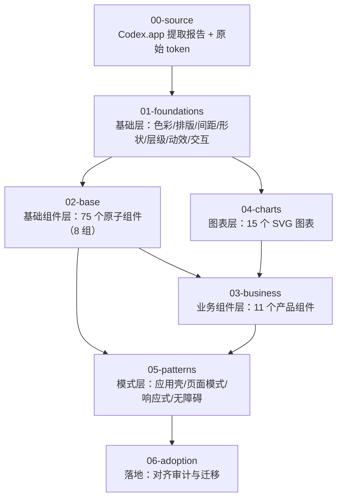

# Tessera Design System — Codex 风格组件设计总纲

> 依据 `/Applications/Codex.app`（OpenAI Codex 桌面端，2026-06 构建）webview 主题的逆向提取结果，
> 为 Tessera 组件库（101 个组件页：Base 75 / Business 11 / Charts 15）制定的完整分层设计规范。
> 提取方法与原始数据见 `00-source/codex-extraction.md`，全部原始值可机读于 `00-source/codex-tokens.raw.json`。

---

## 1. 设计立场（一句话）

**界面是中性的灰阶乐器，颜色是稀缺事件**：一切结构性视觉（文字层级、边框、分隔、悬停、按压）都由
"前景色 × 固定透明度阶梯" 派生；蓝色只出现在链接、焦点与选中；状态色成对出现（前景/描边/浅底）；
主按钮是 **反相中性**（亮色主题近黑底白字、暗色主题白底近黑字），而不是品牌蓝。

这就是 Codex.app 的视觉骨架，也是 Tessera 的单一真相。

## 2. 分层架构

| 层 | 目录 | 内容 | 对应源码 |
| --- | --- | --- | --- |
| 源 | `00-source/` | Codex.app 提取方法、原始 token 全表（明/暗）、机读 JSON | — |
| 基础 | `01-foundations/` | 色彩、排版、间距布局、形状圆角、层级阴影、动效、交互状态 7 篇 | `src/styles.css` 顶部 `--ct-*`、`src/theme/tokens.ts` |
| 基础组件 | `02-base/` | 通用/布局/导航/数据录入/数据展示/反馈/其他/自有扩展 8 组 75 件 | `src/components/base/*` |
| 业务组件 | `03-business/` | 指标卡、工具栏/筛选、命令面板、代码与内容渲染 3 组 11 件 | `src/components/business/*` |
| 图表 | `04-charts/` | 图表基座 + 基础/统计/关系与文本 3 组 15 件 | `src/components/charts/*` |
| 模式 | `05-patterns/` | 应用壳层、页面模式、响应式与移动端、无障碍 | `src/docs/DocsShell.tsx` 等 |
| 落地 | `06-adoption/` | 现状差距审计（含遗留 `--codex-*` 草稿变量清退）、迁移顺序、DoD | — |

## 3. 令牌命名约定

- **前缀 `--ct-`**（Codex-Tessera）：语义令牌，组件唯一允许消费的层。已在 `src/styles.css` 落地。
- **原始参考值**：文档中以 `gray-900 #181818` 这类 Codex 原生名标注出处；实现层不直接暴露原始灰阶。
- **两主题**：亮色为默认 `:root`；暗色由 `:root[data-theme="dark"]` 覆写同名令牌，组件零改动切换。
- 遗留的 `--codex-*` 变量（`src/theme/codex-variables.css`，Tailwind 蓝灰草稿）与本规范**不一致**，
  属清退对象，见 `06-adoption/README.md`。

## 4. Codex 风格十大不可妥协点

1. **前景派生**：边框 = 前景 5/8/12–16%，文字 = 前景 100/70/50/18%，一律 `color-mix(in oklab, …)`。
2. **反相主按钮**：亮 `#0d0d0d`→白字；暗 `#ededed`→近黑字。蓝色不做主按钮。
3. **暖中性面层电梯**：亮 `#fff` 面 / `#f9f9f9` 底；暗 `#0d0d0d` 底 → `#181818` 画布 → `#212121` → `#282828` → `#303030` 逐级抬升。
4. **Squircle 圆角**：radius 刻度 2–24px ×全局缩放；支持 `corner-shape: superellipse(1.5)` 时缩放取 1.25。
5. **发丝层级**：0.5px hairline 描边（前景 12–20%）+ 低透明度软阴影栈；悬浮面板 = 半透明面 + backdrop-blur。
6. **克制的字号**：正文 14px，密集 UI 12px，辅注 11px；标题用 **medium(500)** 而非 bold；对话框标题 20px/-0.36px。
7. **药丸导航行**：侧栏行高 ~30px、`radius-full`，悬停为前景低透明水洗。
8. **动效两档**：150ms basic / 300ms relaxed；入场 `cubic-bezier(.19,1,.22,1)`，出场 `cubic-bezier(.65,0,.4,1)`；全局尊重 `prefers-reduced-motion`。
9. **焦点环唯一**：`:focus-visible` 时 2px 蓝环（blue-300 系）偏移 2px；鼠标按下不出环。
10. **状态色三件套**：success/warning/danger/info 各配 前景 + 描边(40%/15%) + 浅底(7–16% 混合)，暗色整体提亮一档。

## 5. 阅读顺序建议

- 视觉/设计同学：`01-foundations` 全部 → `05-patterns/01-app-shell.md` → 各组件层。
- 组件开发同学：`02-base/README.md`（解剖与状态矩阵约定）→ 所负责分组文件 → `01-foundations/07-interaction-states.md`。
- 图表开发同学：`04-charts/README.md`（基座与色板策略）→ 对应图表族文件。
- 治理/验收同学：`06-adoption/README.md`。

## 6. 与根目录 `design.md` 的关系

根目录 `design.md` 是本规范的前身摘要，其结论（中性灰阶、前景派生边框、`#0285ff` 强调、4px 栅格）
与本规范一致但粒度不足；本目录是唯一详细版本，冲突时以本目录为准。
