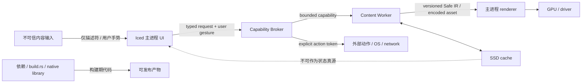

# Tessera Iced G0 威胁模型

> 文档状态：G0 白帽收口稿（source identity 已解析；native 证据未运行） 
> 审查日期：2026-08-17（Asia/Shanghai） 
> 目标相对路径：`native/docs/threat-model.md` 
> 审查角色：白帽架构专家 
> 结论：**G0 仍阻断（仅源码基线项已解析）；无可复现的 native 漏洞发现**

## 1. 结论先行

本轮审查冻结的是 Tessera Iced 的目标信任边界、资源合同和验证门禁，不是对已运行 native 程序的渗透测试。`iced-plan.md` 明确写明“本轮只规划，不创建 Rust 工程、不迁移组件、不启动 native 服务”。源项目现已建立可定位、clean 的 Git source baseline，但仍只有 baseline 文档/脚本，没有可执行 Rust/native 实现、Cargo 清单、`rust-toolchain.toml` 或 `build.rs`。因此：

- **已解析（`G0-B01` / `SG-G0-01` / `SEC-B0`，范围仅限 source identity）**：revision `b9c797d8dcd8ed044bd6a4f5bc479bfe52296810`、tracked-file manifest SHA-256 `b4dfd2064e8d30cd24f72f1347ece2ef525c5f0673796035cb4415f1ae866c0a`、`487` 个 tracked files 和 clean worktree 已核验。冻结源历史内容不包含 `native/docs/baseline-run.md`；按 G0 mechanical integration runbook，最终 integration overlay 必须引入并校验该记录。其存在与校验通过只证明 Web/design source identity 及可复做合同，不证明 native implementation、平台、低配、GUI/IME/DPI、读屏、renderer、供应链、签名、安装或发布门禁。
- **仍阻断 G0（`G0-B02` / `SEC-B0`，范围为 native spike evidence）**：尚无可执行 native spike harness、独立 native implementation/spike revision、Rust/toolchain 决策、精确 iced/renderer/features、Cargo.lock、平台探针和低配结果。source revision `b9c797...` 只能标识 Web/design 输入，严禁填入 native implementation revision 字段。
- **未实现/不可验证（SEC-U01）**：主进程、Capability Broker、Content Worker、缓存和 renderer 控制尚未实现；这是当前阶段状态，不是漏洞。相关验证标为 `NOT RUN`，不能把设计要求写成“已验证安全”。
- **无发现**：在不存在 native 攻击面的前提下，没有可以复现、归因到 Tessera Iced 的漏洞。不要把“没有代码”误报成“安全通过”。
- **风险池（非当前漏洞）**：现有 React/Web 的 Markdown、SVG、URL 和上传防护只能作为输入安全参考，不能直接继承为 native 安全结论；计划也明确禁止把浏览器消毒器输出当作 native 结论。

发布裁决是“暂不发布/不进入 G1 安全绿灯”。source identity 已完成，不再 handback 重建；下一可执行动作是由 native spike owner 建立可执行对象及其独立 revision，锁定工具链和 feature，再按本模型逐边界补证据。

## 2. 冻结范围与证据口径

### 2.1 目标架构范围

冻结以下逻辑边界及其数据流：

1. Iced 主进程（UI、应用状态、消息路由、renderer 编排）。
2. Capability Broker（文件、剪贴板、拖放、URL 和未来外部动作的唯一授权点）。
3. Content Worker（不可信内容的解码、解析、转换和资源计量）。
4. Safe IR/受控缓存（仅承载版本化、大小受限、不可执行的结果）。
5. SSD 缓存（可再生优化，不是状态真源）。
6. 内容输入（文件、SVG、图片、字体、Markdown、Mermaid、剪贴板、拖放和 URL）。
7. 外部动作（打开 URL、文件选择/打开、剪贴板写入；命令执行首发关闭）。
8. GPU/driver（不可信的设备边界和资源消耗边界）。
9. Rust/iced/wgpu/tiny-skia 及带 `build.rs`、native library、`unsafe` 或网络下载行为的依赖。

不在本轮范围：完整 React/Web 安全审计、操作系统本身、第三方依赖内部漏洞复现、插件 ABI、移动端/WASM、任意 HTML/WebView，以及尚未通过独立 spike 的 Markdown/Mermaid 首发能力。

### 2.2 审查规则

- 事实分为 `已观测`、`冻结要求`、`待验证` 三类；不能用计划、样例或 Web 代码冒充运行证据。
- 白帽预算按九个信任边界计数；每个阻断只允许一次针对性复测，攻击面改变后才登记新一轮预算。
- 只有直接影响安全、数据完整性、资源可用性或发布门禁的问题才标为阻断；其余进入风险池并写明 owner、阶段和最小后续动作。
- 证据必须分列 `source_revision` 与 `native_revision`，并带工具链/依赖版本、feature、OS/架构、renderer/driver、DPI、fixture/seed、命令、指标、trace/profile 或截图及结论；native 对象不存在时 `native_revision` 留空并标 `NOT RUN`，不得用 source revision 代填。

### 2.3 当前事实快照

| 事实 | 证据 | 口径 |
|---|---|---|
| Iced 仍处规划阶段 | `iced-plan.md` 第 3、24、468-474 行 | 设计输入，不是实现证据 |
| source identity 事实、环境合同与脚本可定位 | Git revision/manifest/file count/clean check、`native/docs/environment.md`、`native/scripts/bootstrap-baseline.sh`；G0 final integration overlay 必须引入并校验 `native/docs/baseline-run.md` | 冻结源历史内容不包含该路径；记录的存在与校验通过只证明 Web/design source identity 与可复做合同，不证明 native implementation、平台、低配、GUI/IME/DPI、读屏、renderer、供应链、签名、安装或发布门禁 |
| source revision/manifest/工作树已解析 | `bootstrap-baseline.sh --target "${TESSERA_SOURCE_ROOT}"`、`git ls-files -s -z \| shasum -a 256`、`git status --porcelain` | `G0-B01 / SG-G0-01 / SEC-B0(source identity)` 为 `RESOLVED`；仍不等于 G0 安全通过或 native implementation revision |
| 没有可执行 native 实现 | 排除 `node_modules/`、`dist/`、`tmp*` 后，仅见 baseline 文档/脚本；无 `Cargo.toml`、`Cargo.lock`、`rust-toolchain.toml`、`build.rs` | `SEC-U01`；worker/broker/renderer/runtime 控制为 `NOT RUN` |
| Web 内容防护存在 | `src/utils/markdown.ts`、`src/utils/svg.ts`、`src/utils/url.ts`、Mermaid viewer | 仅为迁移参考，不是 native 证据 |
| Web 依赖门禁存在 | `scripts/scan-deps.mjs`、`package.json` | 不能替代 Cargo 供应链门禁 |

## 3. 资产、角色与安全目标

### 3.1 保护资产

| 资产 | 需要保护的性质 | 失败后果 |
|---|---|---|
| 用户内容、文件和剪贴板原文 | 机密性、完整性、最小留存 | 泄露、错误展示、跨用户污染 |
| 文件/目录 capability 与外部动作 | 授权正确性、不可越权 | 任意读取、写入、打开或执行 |
| 应用状态、选择和异步结果 | 完整性、代际一致性 | 过期结果覆盖新状态、错误批量操作 |
| Safe IR、缓存索引和对象 | schema 完整性、可恢复性 | 缓存投毒、崩溃、持久化敏感数据 |
| 主进程、worker 和队列 | 可用性、故障隔离 | UI 卡死、OOM、跨边界崩溃 |
| GPU 资源和 renderer 状态 | 资源上限、设备丢失恢复 | 驱动重置、渲染拒绝服务 |
| 构建产物、依赖和签名 | 供应链完整性、可追溯 | 构建时执行任意代码、发布植入 |

### 3.2 角色与攻击者

- 普通用户：可通过手势提交文件、拖放、剪贴板和 URL；不应获得隐含 OS 权限。
- 恶意内容提供者：可控制文件字节、文件名、SVG/图片元数据、Markdown/Mermaid、URL、剪贴板或拖放声明。
- 本机其他进程/恶意路径：可改变符号链接、文件内容、缓存文件或设备状态，制造 TOCTOU、缓存投毒和资源耗尽。
- 受污染依赖/构建环境：可通过依赖、`build.rs`、native library、下载脚本或不安全代码影响构建产物。
- 不可信 GPU/驱动：不是应用信任根；可能返回错误、丢失设备或消耗超预算资源。

### 3.3 安全目标

1. 不可信字节不能直接变成可执行代码、原始 widget 树、原始 SVG/HTML 或 OS 动作。
2. 所有能力都显式授权、可限时/限次，且由用户手势触发；组件没有 ambient authority。
3. 输入大小、解析复杂度、队列、缓存、CPU、内存和 GPU 资源全部有界，可取消、可超时、可恢复。
4. 主进程保持响应，不执行同步磁盘/网络 I/O、解码、解析或全量数据处理。
5. 缓存损坏、worker 崩溃、设备丢失和依赖回滚不会破坏状态真源或泄露敏感数据。
6. 每个安全声明都能由固定 revision 和可重放证据复核。

## 4. 目标数据流与信任边界

以下是**目标数据流**，不是当前已部署拓扑。箭头右侧的数据必须经过边界控制后才能继续流动。

**必须冻结的不变量**：

- 主进程只消费类型化消息、Safe IR 和受控句柄；不得接收任意解析器输出或直接拼接 OS 路径。
- Broker 是所有 capability 的唯一颁发/拒绝点。组件不能直接访问文件、网络、进程、系统命令、剪贴板或拖放 API。
- Worker 的失败、超时、取消、OOM 只转成类型化错误；不能让 panic、未捕获异常或原始字节穿越到主进程。
- renderer 只接受经过 schema、尺寸、颜色/几何和资源预算校验的结果；不执行脚本、不解析 HTML、不解析外部资源。
- 缓存对象以固定长度 hash 命名并校验内容/schema；命中、缺失、损坏和旧版本都按 miss/重建处理。
- GPU/driver 被视为不可信输出边界；设备丢失须回收并切换兼容构建或错误状态，不能扩大权限。

### 4.1 边界冻结表

| ID | 边界/信任假设 | 允许穿越的数据 | 强制控制 | 当前状态 |
|---|---|---|---|---|
| TB-01 | 主进程是编排与状态信任根，但 UI 输入不可信 | typed message、Safe IR、受控资源句柄 | `view/update/layout` 禁止同步 I/O/解析；无 raw HTML/SVG/命令；异步结果带 generation | 未实现/不可验证；G1/G2 验证 |
| TB-02 | Broker 是唯一 capability authority；请求者默认无权 | 资源化请求、用户手势证明、短期 action token | 协议/根目录/作用域/次数/过期校验；路径规范化后授权并复核 TOCTOU；拒绝 shell | 未实现/不可验证；G1/G5 验证 |
| TB-03 | Worker 不信任输入和解析库；主进程不信任 worker 原文 | 有界 bytes -> versioned Safe IR/错误 | 有界队列、超时、取消、并发、内存；高风险解析器用隔离进程/沙箱；失败可重启 | 未实现/不可验证；G1/G3/G5 验证 |
| TB-04 | SSD 和索引可被删除、篡改、截断或旧版本污染 | hash 对象、元数据、schema 版本 | 内容寻址、原子写、校验后发布、WAL；敏感内容默认不落盘；权限拒绝按 miss | 未实现/不可验证；G3 验证 |
| TB-05 | 文件、SVG、图片、字体、Markdown、Mermaid、剪贴板、拖放均不可信 | 原始输入只进入 Broker/Worker | 长度/数量/复杂度上限；禁止脚本/事件/外部引用；拒绝超限并可见反馈 | 未实现/不可验证；G3/G5 验证 |
| TB-06 | OS、网络和用户意图是外部动作边界 | 明确协议、路径或动作类型 | 首发仅 `http/https` URL；用户手势；一次性 token；命令执行关闭；无 shell | 未实现/不可验证；G1/G5 验证 |
| TB-07 | GPU/driver 不是信任根 | 已计量的纹理、图集、Canvas 几何 | 96 MiB 软限/160 MiB 硬限；设备丢失恢复；兼容 renderer 可用 | spike 未运行；G4 完整验证 |
| TB-08 | 依赖、`build.rs` 和 native library 具有构建期高权限 | 锁定源码、生成文件和构建产物 | 精确版本/lockfile；人工审查 build/native/unsafe/下载；audit/deny/SBOM/签名 | 源码身份 baseline 已解析；无 native 构建可审，toolchain/供应链控制仍 `NOT RUN`，G5 验证 |
| TB-09 | 日志/诊断系统不是内容信任边界 | 事件类型、计数、hash、错误码 | 默认不记录原文、令牌、路径敏感部分；结构化脱敏；崩溃报告去敏 | 未设计/不可验证；G1/G5 验证 |

## 5. 威胁场景与控制合同

状态含义：`设计要求` 表示必须实现；`待验证` 表示不能以文档替代证据；`无当前发现` 表示本轮没有 native 漏洞可复现。

| ID | 场景/攻击路径 | 影响 | 设计控制与可验证断言 | 当前判定 |
|---|---|---|---|---|
| T-01 | `..`、符号链接、UNC/设备路径、大小写差异或 TOCTOU 绕过文件根目录 | 任意读写、越权导入 | 先规范化再授权；capability 绑定允许根；打开时使用目录句柄/等价安全 API 并复核对象；不跟随拖放目录符号链接 | 待验证；未形成 native 漏洞 |
| T-02 | 恶意 SVG 触发脚本、事件、外部引用、`foreignObject` 或高成本 filter | 内容注入、网络访问、解析 DoS、renderer 崩溃 | 输入和节点/路径/嵌套有界；禁止脚本、事件、动画、外部引用、嵌入图片和高成本 filter；只输出 Safe IR | 待验证；未形成 native 漏洞 |
| T-03 | 图片元数据或压缩格式制造解码炸弹 | worker OOM、主进程卡死、GPU 超限 | 输入、像素、单边、解码后内存四重上限；解码在 worker；超时/取消/进程重启；主进程只收受控位图 | 待验证；未形成 native 漏洞 |
| T-04 | Markdown/Mermaid 通过 raw HTML、链接、图表语法或解析器 bug 逃逸 | 任意内容执行/资源耗尽 | Markdown 丢弃 raw HTML；链接仅产生待授权 Action；首发不进入 P0；引入时受限解析器或沙箱辅助进程，禁止 Chromium/WebView | 设计阶段风险；G3 前阻断 |
| T-05 | 恶意剪贴板或拖放声明造成隐式读取、路径泄露或批量资源耗尽 | 隐私泄露/DoS | 只在用户手势读取；文本上限；拖放项数/声明总大小上限；目录不递归、不跟随符号链接；展示文件名按文本渲染 | 待验证；未形成 native 漏洞 |
| T-06 | URL、文件打开或未来命令参数注入外部 OS | 任意程序/协议/网络动作 | URL 显式协议白名单；首发仅 `http/https`；单 URL 限长；Broker + 用户手势；命令执行关闭，未来也禁止 shell/字符串直达 OS | 待实现；G1/G5 阻断 |
| T-07 | 缓存 key/路径拼接、缓存投毒、短写或旧 schema 被当成有效对象 | 数据错读、敏感数据残留、崩溃 | 固定 hash key；原子临时文件 -> 校验 -> sync -> rename -> WAL；旧/损坏/权限拒绝按 miss；提供清空入口 | 待实现；G3 阻断 |
| T-08 | 无界 `spawn`、channel、队列、重试或缓存被输入放大 | CPU/RSS/磁盘耗尽 | 所有队列、并发、缓存、输入、GPU 资源有上限且可取消；过载返回可见错误，不静默排队 | 待实现；G1/G3 阻断 |
| T-09 | GPU 纹理/图集或几何请求耗尽驱动资源，设备丢失后状态不一致 | 渲染 DoS、数据展示错误 | 96/160 MiB GPU 预算；每次上传计量；设备丢失清理并重建；tiny-skia 独立兼容构建 | 待实现；G4 阻断 |
| T-10 | 过期异步结果覆盖新选择/新授权，或重复 action 重放 | 数据完整性、错误批量操作 | 请求带 generation、capability id 和一次性动作 id；过期结果直接丢弃；状态机属性测试覆盖乱序/重试 | 待实现；G2/G3 阻断 |
| T-11 | 错误日志、缓存、trace 或崩溃报告写入原文/令牌/绝对路径 | 敏感信息泄露 | 结构化错误码和长度/类型/hash；路径脱敏；默认不落盘敏感原文；日志字段白名单 | 待实现；G1/G5 阻断 |
| T-12 | 依赖或 `build.rs` 在构建期间下载/执行未审查代码 | 供应链植入、发布后门 | Cargo.lock、精确 iced/features、离线/可重现构建；人工审查 build/native/unsafe/网络；cargo-deny/audit、SBOM、签名 | 源码身份已解析，但当前无 native 构建可审；`SEC-U01 / NOT RUN`，G0/G5 待证据 |
| T-13 | worker panic、解析器挂死、磁盘满或缓存索引损坏传播至主进程 | UI 崩溃、数据丢失 | worker 进程/任务可杀可重启；超时和取消；旧有效缓存保留；前台按 miss；错误是 typed state | 待实现；G3 阻断 |

## 6. 资源限制（冻结目标，不是已测结果）

以下数值来自 `iced-plan.md` 的 Must-fix/SSD 合同。任何放宽都必须有 ADR、实测和风险 owner；没有实现或实测时不得写成“已通过”。

### 6.1 输入与解析

| ID | 输入 | 上限/默认 | 超限处置 |
|---|---|---:|---|
| `RES-IMG-01` | 图片输入与解码 | 输入 `<= 32 MiB`、`<= 16 MP`、单边 `<= 8192`；解码后 `<= 64 MiB` | 在 worker 前/内拒绝并取消；不提交 GPU |
| `RES-SVG-01` | SVG | `<= 2 MiB`、节点 `<= 1,200`、路径指令 `<= 50,000`、嵌套 `<= 64` | 拒绝；禁止脚本、事件、动画、`foreignObject`、外部引用、嵌入图片、高成本 filter |
| `RES-MERMAID-01` | Mermaid（若引入） | 最多 8 block；每 block `<= 12,000` 字符；`<= 260` statements | 首发不进 P0；未来受限解析器/沙箱，单 worker `<= 256 MiB`、单次 `<= 3.5s`、并发 1 |
| `RES-CLIP-01` | 剪贴板文本 | `<= 1 MiB`，且仅用户手势读取 | 拒绝或截断并显式提示；禁止轮询 |
| `RES-DROP-01` | 拖放 | 最多 32 项；声明总大小 `<= 128 MiB` | 拒绝超限项；目录默认不递归、不跟随符号链接 |
| `RES-URL-01` | URL | 单 URL `<= 8 KiB`；首发协议 `http/https` | Broker 拒绝；不把字符串交给 shell/进程 |

### 6.2 任务、缓存与 renderer

| ID | 资源 | 软限/默认 | 硬限/阻断 |
|---|---|---:|---:|
| `RES-WORKER-01` | 阻塞 I/O / CPU worker | 2 / 2 | CPU worker 上限 4；队列有界、可取消 |
| `RES-DECODE-01` | 图片解码 / SVG 派生 | 各最多 2 并发 | 超过即排队/拒绝，不能无界 spawn |
| `RES-DISK-01` | 磁盘读 / 写 | 4 / 1 并发 | 写入必须原子；短写/满盘不破坏旧对象 |
| `RES-CACHE-01` | SSD cache | 默认 512 MiB；SLRU probation/protected 25%/75% | 可配 `128 MiB..2 GiB`；90% 开始回收，降至 75% 停止；可用空间低于 5 GiB 或磁盘 10% 时禁止增长 |
| `RES-CACHE-IDX-01` | cache 内存索引 | 访问时间每 30 秒或 256 次命中批量落库 | `<= 8 MiB`；启动禁止全目录扫描 |
| `RES-CACHE-OBJ-01` | 对象内存 cache | 文本布局 `<= 16 MiB / 8,000` 项；解码图片 48 MiB 软限；SVG 16 MiB 软限；数据窗口 16 MiB 软限 | 解码图片 64 MiB、SVG 24 MiB、数据窗口 32 MiB 硬限 |
| `RES-GPU-01` | GPU 管理资源 | 96 MiB | 160 MiB；超限降级或拒绝 |
| `RES-UIIO-01` | UI 热路径同步文件 I/O | 0 次 / 0 字节 | 任意一次立即阻断 |
| `RES-IOLAT-01` | 注入 100 ms 磁盘延迟 | UI 调度 p95 `<= 2 ms` | 超出即阻断；UI 不等待磁盘 |

### 6.3 失败与恢复不变量

- 缺失、损坏、旧 schema、权限拒绝、磁盘满和短写都表现为 cache miss/可见错误，不覆盖旧有效缓存。
- `RES-CACHE-OBJ-01` 的文本布局不落盘；图片只保存原始编码和受控缩略图；SVG 只保存已验证源和派生位图；数据窗口仅可选保存可再生页；GPU 资源不落盘。
- 所有任务有取消和 deadline；结果带 generation，过期结果丢弃。
- 最小化/不可见窗口停止预取、动画和非必要缓存维护。
- 设备丢失可以重建 renderer 或切换独立兼容构建；不以关闭安全检查换取恢复。

## 7. 验证矩阵

### 7.1 静态与构建检查

| 检查 | 通过条件 | 阻断条件 |
|---|---|---|
| 源码基线 | Git revision 或完整归档 SHA-256 可复现 | 只能依赖本机未记录状态 |
| crate 边界 | 首期最多 3 个生产 crate；`tessera-core` 无 iced/wgpu/OS 依赖 | 跨边界直接读文件/网络/窗口 |
| unsafe | 自有 crate 默认 `#![forbid(unsafe_code)]`；例外有 ADR、隔离模块和复核 | 未审查 `unsafe` 或 FFI |
| feature/renderer | 精确 `iced 0.14.0` spike、最小 feature；wgpu/tiny-skia 分包 | 默认 feature 携带未审 renderer/平台 |
| build/dependency | lockfile、精确版本、无未审下载；build.rs/native/unsafe 逐项人工审查 | 构建期网络/代码执行无记录 |
| 输出检查 | Safe IR schema、动作 token 和错误类型可定位 | raw bytes/raw HTML/raw SVG/命令字符串进入主进程 |

### 7.2 单测、属性测试与 fuzz

最低覆盖：

- 路径规范化、根目录 capability、符号链接/UNC/设备路径/TOCTOU corpus。
- SVG、图片元数据、缓存索引、拖放路径、Markdown/Mermaid 边界解析器 fuzz；每个高风险状态机至少 1,000 个固定 seed，可重放。
- Safe IR 反序列化拒绝未知/超限 schema；异步乱序、取消、重复 action、generation 丢弃属性测试。
- worker 超时、panic、OOM/进程退出、磁盘满、权限拒绝、截断和设备丢失故障注入。

### 7.3 交互与外部动作

- 只有真实用户手势才能读取剪贴板、提交拖放和启动 URL/文件动作；键盘等效手势也必须可追踪。
- URL 协议、长度和 token 过期测试；命令执行首发测试必须证明关闭，而不是只测“没有按钮”。
- 路径授权在规范化前后、符号链接替换和重试时保持同一根目录；拒绝事件不泄露完整本机路径。
- 外部动作失败、取消和重复点击均不改变业务状态真源。

### 7.4 性能、内存与 renderer

在 MacBook Air M1 8 GiB、Windows 11 i5-8250U 8 GiB/UHD 620 等计划参考机上，以 release/strip、固定分辨率和缩放至少运行 5 次并舍弃首轮；取较差结果。除安全资源上限外，必须同时满足计划中的 CPU/RSS、启动、帧时间、GPU 和 8 小时增长门槛。任何热路径同步 I/O、无空闲持续 redraw、p95 恶化 >5% 或 p99 恶化 >10% 均阻断。当前没有真实低配设备、GUI 或 renderer 运行，以上项目全部 `UNVERIFIED`，对应 G0/G4 门禁保持 `BLOCKED` 或 `NOT RUN`。

### 7.5 供应链与发布

必须有：`cargo fmt`、`cargo clippy -D warnings`、workspace tests、MSRV 检查、`cargo deny`、`cargo audit`、许可证/重复依赖检查、SBOM、依赖清单、签名/校验和及可重现构建信息。升级 iced、Rust、renderer 或 feature 必须独立变更并附 changelog、性能和视觉证据。当前没有 Cargo/native 构建对象，供应链结果为 `NOT RUN / UNVERIFIED`，不能从 Web 的 `bun.lock` 或扫描脚本外推。

## 8. 当前发现、风险池与退出条件

### 8.1 已解析

**G0-B01：Web/source identity 基线缺失。状态：`RESOLVED`。**

- 证据：Git revision、tracked-file manifest、tracked file count 与 clean 状态已核验；`native/docs/environment.md` 记录纳入/排除范围和 manifest 算法；`native/scripts/bootstrap-baseline.sh` 在现有仓库上以 validation-only 方式复做并返回 `verified-existing-git`。冻结源历史内容不包含 `native/docs/baseline-run.md`；按 G0 mechanical integration runbook，最终 integration overlay 必须引入并校验该记录。其存在与校验通过只证明 Web/design source identity 及可复做合同，不证明 native implementation、平台、低配、GUI/IME/DPI、读屏、renderer、供应链、签名、安装或发布门禁。
- 固定值：revision `b9c797d8dcd8ed044bd6a4f5bc479bfe52296810`；manifest `b4dfd2064e8d30cd24f72f1347ece2ef525c5f0673796035cb4415f1ae866c0a`；tracked files `487`；worktree clean。
- 适用边界：只证明 Web/design source identity。它不证明 native workspace、native implementation revision、toolchain、renderer、平台、性能、读屏、供应链或发布门禁通过。

### 8.2 阻断

**G0-B02：native spike identity 与可执行证据缺失。状态：`BLOCKED`。**

- 证据：source tree 的 `native/` 下只有 `native/docs/environment.md` 与 `native/scripts/bootstrap-baseline.sh`；没有 `Cargo.toml`、`Cargo.lock`、`rust-toolchain.toml`、`build.rs`、可执行 spike harness 或 native 运行证据。
- 影响：无法运行静态检查、fuzz、worker 隔离、路径/动作授权、缓存故障、GPU device-loss、IME/AccessKit/读屏、低配性能或 Cargo 供应链门禁；无法为 native implementation/spike 填写独立 revision。
- 处置：native spike owner 建立可复做 harness 和独立 revision，锁定 Rust/MSRV、iced/renderer/features 与 Cargo.lock，并提交平台/低配证据；最小三 crate production workspace 仍属于 G1。

### 8.3 未实现/不可验证（不是漏洞）

**SEC-U01：所有 native 控制仍是未实现要求。**

- 证据：没有可执行 Capability Broker、Content Worker、SSD cache、External Action Broker 或 renderer 代码。
- 影响：不能宣称输入已隔离、资源已封顶、缓存可恢复、外部动作已授权或 GPU 已受控。
- 处置：当前统一标 `NOT RUN`；在 G1/G3/G4/G5 各自提交接口、失败语义、测试和故障注入证据。到达对应门禁后仍缺证据时，才按 `SEC-B1..B6` 阻断。

### 8.4 风险池（不作为当前漏洞）

| 风险 | 不阻断理由 | 最小后续动作 | 责任阶段 |
|---|---|---|---|
| source revision 被误填为 native implementation revision | source identity 已真实解析，但 native 对象尚不存在；当前没有可利用漏洞 | 证据 schema 分列 `source_revision` 与 `native_revision`；native revision 缺失时保持 `NOT RUN` | G0/G1 |
| Web sanitizer 与 native Safe IR 语义可能漂移 | native 尚未存在，无法形成当前攻击路径 | 为 Rust parser 建独立 corpus/fuzz；不复用 DOMPurify 结论 | G1/W5 |
| Markdown/Mermaid 未来引入复杂解析器 | 计划明确不进入 P0 | 独立 spike，沙箱、超时、内存和无 WebView 证据齐全后再入 API | G3/G5 |
| 用户字体、远程资源和插件扩大攻击面 | 首发默认关闭 | 另立威胁模型、能力令牌和回滚计划 | G5 |
| 依赖/构建环境尚无 Cargo 证据 | 当前没有 native 构建产物可被植入 | 锁 Cargo.lock，离线/可复现构建并生成 SBOM/签名 | G0/G5 |

### 8.5 G0 退出条件

G0 只有在以下证据全部存在且复核通过后才能关闭：

1. source revision/manifest 与 native implementation/spike revision 分列记录；前者已完成，后者不得借用 `b9c797...`。
2. Rust/MSRV、iced 精确版本、renderer/feature、Cargo.lock 和目标平台矩阵。
3. 空窗口启动、空闲 CPU/RSS、截图/软件 renderer 链路和低配基准。
4. 主进程、Broker、Worker、cache、外部动作和 GPU 的接口/状态/资源合同；G0 只冻结合同，不把后续实现测试伪装为已运行。
5. 代表性恶意输入 corpus、路径/动作授权和 worker 故障注入的测试计划及 owner；仅对 G0 已实现的 spike 执行相应检查，其余标 `NOT RUN` 并路由到 G1/G3/G4/G5。
6. 所有阻断项一次针对性复测通过；剩余风险有 owner、期限、公开限制和复核门禁。

当前第 1 项仅 source identity 子项完成；第 1 项的 native revision 子项和第 2-6 项均未满足。没有真实 GUI/设备/AccessKit/读屏/IME/低配或 24h soak 证据，相关结论保持 `BLOCKED / UNVERIFIED / NOT RUN`。

### 8.6 Handback

- source baseline owner：`G0-B01 / SG-G0-01` 已 `RESOLVED`，无需重复建库或重写 revision。
- native spike owner：接收 `G0-B02 / SEC-B0`，提交独立 native revision、harness、toolchain、Cargo.lock、iced/renderer feature 矩阵和可复做命令。
- platform/accessibility owner：在真实目标设备上提交 renderer、DPI、CJK IME、AccessKit 与 VoiceOver/Narrator/NVDA/Orca 证据；未运行前均为 `UNVERIFIED`。
- cache/supply-chain owner：到 G3/G5 提交故障注入、fuzz、build.rs/native/unsafe/download 审查、deny/audit、SBOM 与签名证据；当前为 `NOT RUN`。
- release owner：到 G6 提交同一 native RC revision 的 24h soak、安装/升级/卸载和回滚证据；当前发布保持 `BLOCKED / UNVERIFIED`。

## 9. 参考事实与指纹

审查未修改源项目。以下 SHA-256 是 2026-08-17 读取时的事实指纹；路径相对于已冻结 source revision 的仓库根目录，native 实现建立后必须重新生成并随 revision 记录。

| 文件 | SHA-256 |
|---|---|
| `iced-plan.md` | `df159af9bf67df08e923e8ffdaaa3bb61a83dba5d2901d4496b34bd351424bee` |
| `README.md` | `d600bff91d5ba24b3ca58f5820a48629003fee2982738a45a869d0412b462377` |
| `load.md` | `083c9eb87c113bd58a1154302cc5f7073fd92035d2d6efaf3c2e7297fc44f07a` |
| `design/README.md` | `e95299532b65f82250aa09e06fa9c6420b0ae2420c8f75d55198b9b561b54176` |
| `src/utils/markdown.ts` | `c62ba5fa1cce6e833c3a776ac184dc3e5f6e7ff5a58a5e83d01d793fc7dd83b3` |
| `src/utils/svg.ts` | `611cdd9726c1e5c62245372e7eea81b780cde6a9b4ca514df0afdd5237e18192` |
| `src/utils/url.ts` | `68e71787af07e5c015bc935f4af3ac9383b60cfe2900462b3399668ad4fab0f7` |
| `src/utils/performance.ts` | `9e81db175f79a2053f5d98ef3ad720825ada78822ca8c81328755e5cd1ed32aa` |
| `src/components/business/MarkdownEditor/MermaidSvgViewer.tsx` | `0e52a14184233cb2b21678708d2a00502c6034f6b285d0bfc06f2b7923ed6132` |
| `src/components/base/Upload/Upload.tsx` | `2cd8857ecd9b8fcb15f9d0339ef4f1f17a1cb92143e5e7d8fccf9b7c7df955ef` |
| `scripts/scan-deps.mjs` | `cf0b1bda6288cdb9623a5636cc875633242839759f0882be8a8cd5170112ea29` |

### 9.1 Web 参考控制（不可继承为 native 结论）

- `src/utils/markdown.ts` 使用 `markdown-it` 的 `html: false`、安全链接校验和 DOMPurify；同时限制 Markdown/HTML 长度。
- `MermaidSvgViewer.tsx` 使用 `securityLevel: "strict"`、`htmlLabels: false`，并在注入前调用 `sanitizeSvg`。
- `src/utils/svg.ts` 对节点数、标签、属性、URL 引用和 CSS 做白名单处理。
- `src/utils/url.ts` 拒绝 `javascript:`, `vbscript:`, `data:` 等危险协议；`Image` 组件对图片源和 `srcSet` 做协议检查。
- `Upload.tsx` 做 accept、大小和数量的浏览器侧元数据检查；这不是 native 文件读取、路径授权或沙箱证明。

这些事实说明迁移时应保留“默认不可信、显式白名单、有界资源”的思想；它们不证明 Rust/iced 端已经具备同等控制。
